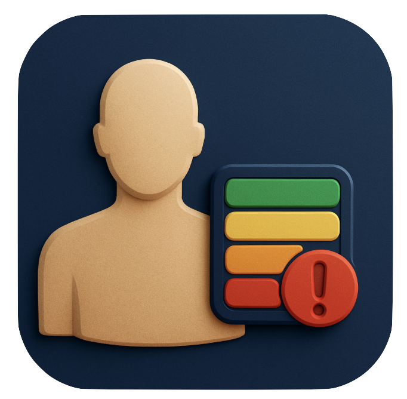

# Escala de Braden – Avaliação de Risco de Lesão por Pressão

<p align="center">
  
</p>

<p align="center">
  <b>Aplicativo para avaliação offline do risco de úlcera por pressão (LPP), com base na Escala de Braden.</b><br>
  Desenvolvido durante o curso de extensão da <strong>Unicamp</strong>, com foco em Flutter Multiplataforma.
</p>

<p align="center">
  <a href="https://apps.apple.com/app/id6746574448" target="_blank">
    
  </a>
  <a href="https://play.google.com/store/apps/details?id=com.ezefranca.escala_braden" target="_blank">
    
  </a>
</p>

<p align="center">
  
</p>

---

## 📚 Sobre o Curso

<p align="center">
  
</p>

Curso: <strong>Introdução ao Desenvolvimento de Aplicativos Multiplataformas com Flutter (CET-0390)</strong>  
Professor: <strong>Ulisses Martins Dias</strong> (Faculdade de Tecnologia - Unicamp)  
Universidade: <strong>Universidade Estadual de Campinas (Unicamp)</strong>

O curso ensina a criar apps para Android, iOS, Web e Desktop usando Flutter e uma única base de código.

---

## 🩺 Sobre a Escala de Braden

A **Escala de Braden** é uma ferramenta validada para avaliação do risco de úlceras por pressão. Ela considera seis domínios clínicos: percepção sensorial, umidade, atividade, mobilidade, nutrição e fricção/cisalhamento.

- Criada por Barbara Braden e Nancy Bergstrom (1988)
- Adaptada e validada no Brasil por Paranhos & Santos (1999)
- Usada amplamente em contextos clínicos e hospitalares

---

## 🔧 Funcionalidades

- Avaliação completa da Escala de Braden
- 100% offline: nenhum dado é coletado
- Interface clara e acessível para uso clínico
- Recomendação automática com base no escore
- Histórico de avaliações (local)

---

## 🚀 Como executar localmente

1. Instale o [Flutter](https://flutter.dev/docs/get-started/install)
2. Clone este repositório:

   ```bash
   git clone https://github.com/ezefranca/escala_braden.git
   cd escala_braden

## Como executar

1. Instale o [Flutter](https://flutter.dev/docs/get-started/install) em seu sistema.
2. Clone este repositório:

   ```sh
   git clone https://github.com/ezefranca/escala_braden.git
   ```

3. Instale as dependências:

   ```sh
   flutter pub get
   ```

4. Execute o app:

   ```sh
   flutter run
   ```

## Créditos

- **Desenvolvedor:** Ezequiel Santos
- **Professor responsável:** Ulisses Martins Dias
- **Universidade:** Unicamp

---

## Direitos Autorais

Braden Scale ©1988 Braden & Bergstrom.
Adaptação brasileira por Paranhos & Santos (1999) conforme artigo publicado na Revista da Escola de Enfermagem da USP.
**Copyright® Braden, Bergstrom 1988. Adaptada e validada para o Brasil por Paranhos, Santos 1999.**
Paranhos WY, Santos VLCG. Avaliação de risco para úlceras de pressão por meio da Escala de Braden, na língua portuguesa. Rev Esc Enferm USP. 1999; 33 (nº esp): 191-206.
Disponível em: <http://www.bradenscale.com/translations.htm> e <http://143.107.173.8/reeusp/upload/pdf/799.pdf>.

> Disclaimer
<p align="center">
  <i>Este aplicativo é uma ferramenta de apoio clínico. O uso dos resultados é de responsabilidade do profissional de saúde.</i>
</p>


